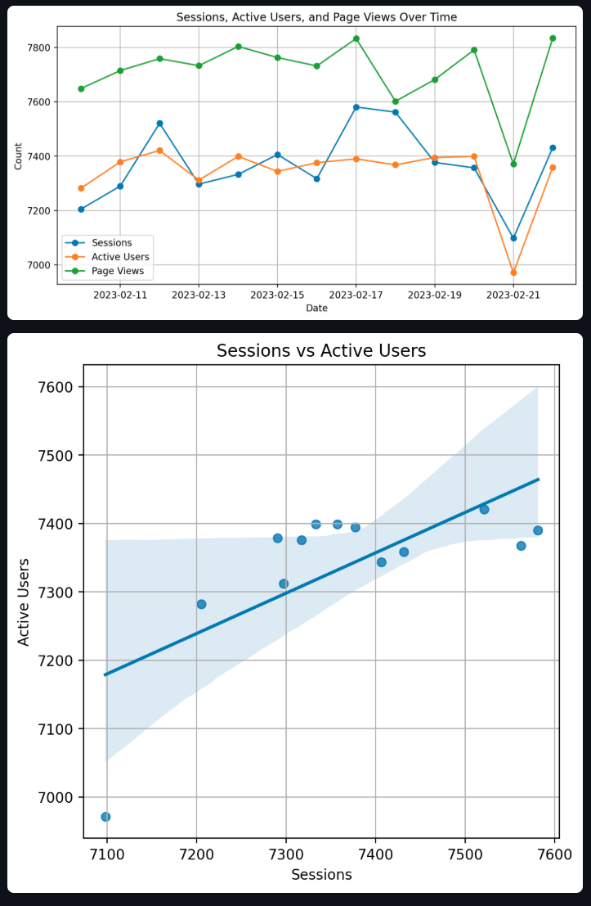

# GA4 Data Analytics

A Python project for fetching, analyzing, and visualizing Google Analytics 4 (GA4) data using the Google Analytics Data API and Streamlit.

## Features

- Fetch sessions and users data from GA4.
- Visualize key metrics with interactive plots.
- Streamlit-based dashboard.

## Installation

```bash
pip install -r requirements.txt
```

## 🔧 Google Analytics & API Setup

To connect this app to your GA4 property, follow these steps:

1. **Create a Google Cloud Project**  
   Go to [Google Cloud Console](https://console.cloud.google.com/), create a project, and enable billing if prompted.

2. **Enable the Google Analytics Data API**  
   Navigate to [this link](https://console.developers.google.com/apis/api/analyticsdata.googleapis.com/overview) and enable the API for your project.

3. **Create a Service Account**  
   - Go to **IAM & Admin > Service Accounts**.
   - Create a service account with any name.
   - Grant minimal roles or skip roles if just testing.

4. **Generate a JSON Key File**  
   - In your service account settings, go to the **"Keys"** tab.
   - Click **"Add Key" > "Create new key"**, choose **JSON**, and download the file.
   - Rename or move it as needed (e.g., `service-account-key.json`).

5. **Grant Access in GA4**  
   - Go to [Google Analytics](https://analytics.google.com/), select your property.
   - Navigate to **Admin > Property Access Management**.
   - Add the **service account email** with **Viewer** or **Analyst** role.

6. **Configure Your App**  
   - Copy `src/config.py.template` to `src/config.py`.
   - Fill in your `GA4_PROPERTY_ID` and path to your key file.

## Run the app

```bash
sh run_app.sh
```

## 📊 Dashboard Preview



